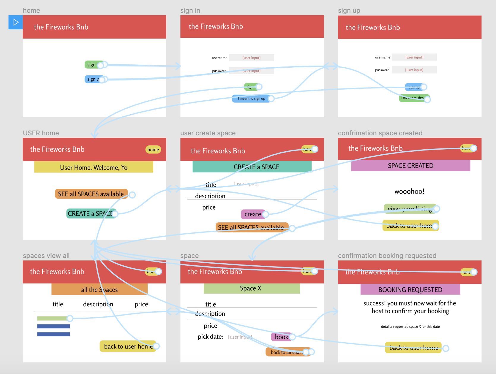

### Fireworks BnB

This is an AirBnB clone, created as a group project for Week 6 of the Makers Academy Course.

#### Collaborators

Team Fireworks: [Hansa](https://github.com/hansa-lallu), [Myrtle](https://github.com/Mrtly), [David](https://github.com/DavidStewartLD) and [Emily](https://github.com/EWright212)

#### Specification & capabilities
A user can: 
- [x] sign up and log in
- [x] list multiple spaces
- [x] name their space, provide a short description of the space, and a price per night
- [x] see spaces available for booking
- [x] request to hire any space for one night
- [x] approve or reject requests made by other users
- [x] see that the status of their request (pending, approved, or rejected)

more functionality to implement
- [ ] host can offer a range of available dates 
- [ ] nights for which a space has already been booked should not be available for users to book that space
- [ ] until a user has confirmed a booking request, that space can still be booked for that night

#### Tech used
- Active Record for Database Management
- Ruby with Sinatra 
- HTML markup & CSS styling

#### How to Run

- Fork this repo
- Clone this repo
- Run command `rackup` in your terminal 
- Open `localhost:9292` in Chrome
 
#### How to Test

- Run command `rspec` in your terminal  

#### Key Learnings

We took an agile approach to our learning with daily standups, sprint planning sessions and retros.

Our website was mocked using figma, shown below. We created different versions for each sprint to keep track of which features we were working on next.

